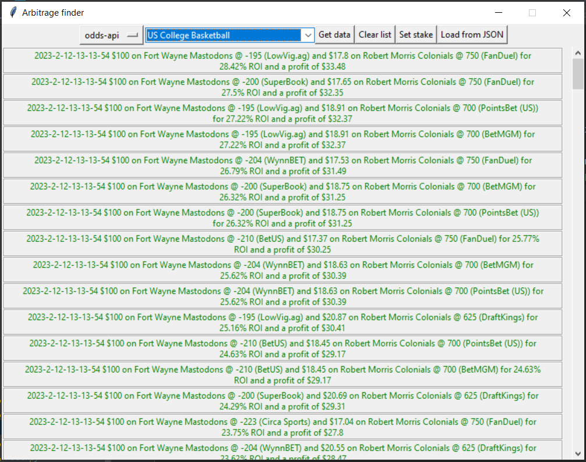

## ArbFinder

GUI tool to find and calculate arbitrage bets. ArbFinder uses [odds-api](https://the-odds-api.com/) to retrieve
betting odds. 

## Usage

The "Get data" button will fetch bookmaker odds for the selected sport for upcoming games. It will also
automatically calculate the arbitrage and populate the main list, which is sorted by highest ROI.

Everytime you make an api call, the JSON response will be stored in a responses folder. You can load
previous responses with the "Load from JSON" button which will add the highest ROI arbitrage opportunities to the main list.

"Getting data" and loading JSON data will only further populate the main list. "Clear list" will reset the main list.

"Set stake" changes the default default stake of $100 to a custom amount.

## Setup

There are no external libraries required. The recommended python version is Python 3.10

In order to retrieve data from odds-api, you will need to create an account at https://the-odds-api.com/ and 
get an api key. For the model to use your api key, create a file called `LOGIN.env` in the root directory
with the following line: `API_KEY=your_api_key`.